# Bitcoin Core Architecture Diagrams

This document contains comprehensive visual representations of Bitcoin Core's architecture, data flows, and component interactions.

## Table of Contents
1. [High-Level System Architecture](#1-high-level-system-architecture)
2. [Component Interaction Overview](#2-component-interaction-overview)
3. [Consensus and Validation Flow](#3-consensus-and-validation-flow)
4. [Networking and P2P Architecture](#4-networking-and-p2p-architecture)
5. [Mempool Transaction Flow](#5-mempool-transaction-flow)
6. [Storage Layer Architecture](#6-storage-layer-architecture)
7. [RPC/API Request Flow](#7-rpcapi-request-flow)
8. [Wallet Transaction Creation](#8-wallet-transaction-creation)
9. [Mining and Block Creation](#9-mining-and-block-creation)
10. [Thread Model and Concurrency](#10-thread-model-and-concurrency)
11. [Data Flow Integration](#11-data-flow-integration)
12. [Error Handling and Recovery](#12-error-handling-and-recovery)

---

## 1. High-Level System Architecture

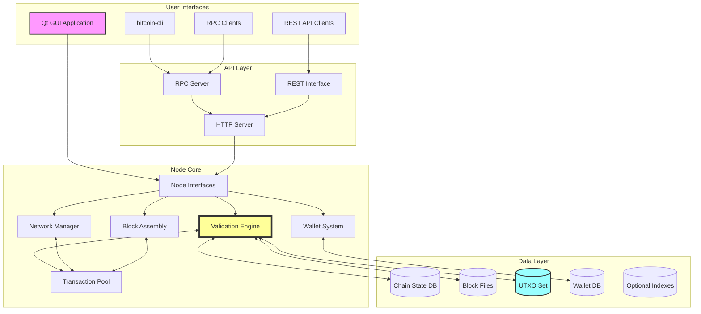

---

## 2. Component Interaction Overview

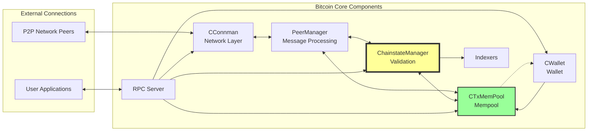

---

## 3. Consensus and Validation Flow

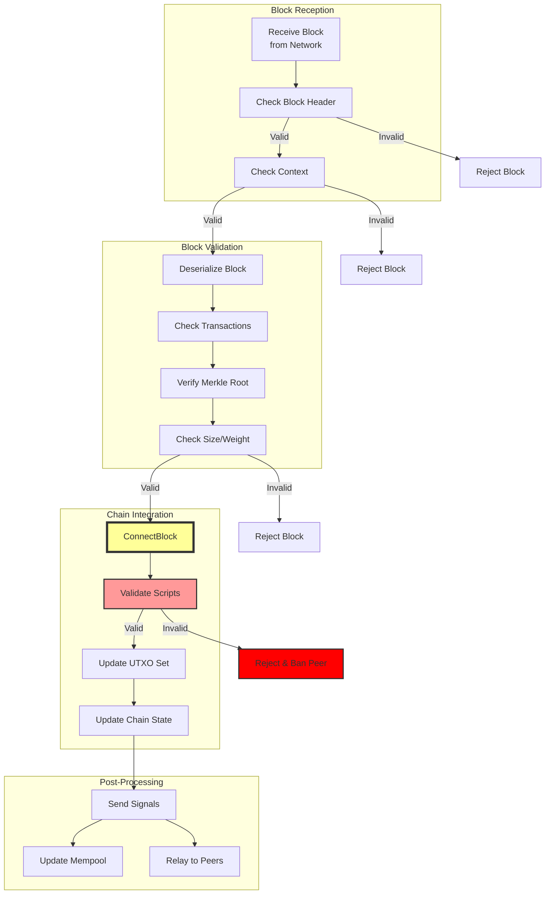

---

## 4. Networking and P2P Architecture

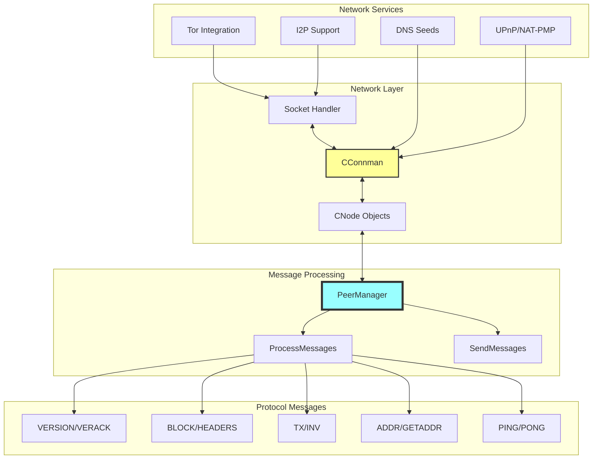

---

## 5. Mempool Transaction Flow

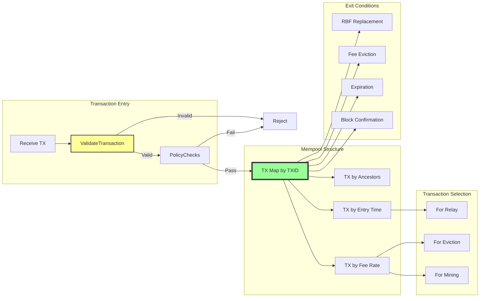

---

## 6. Storage Layer Architecture

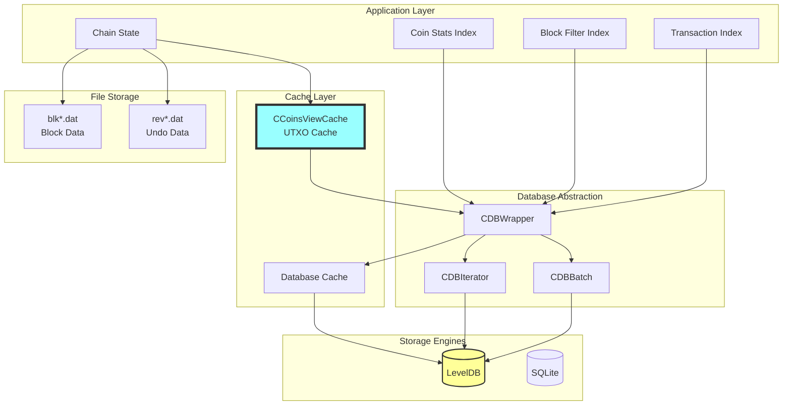

---

## 7. RPC/API Request Flow

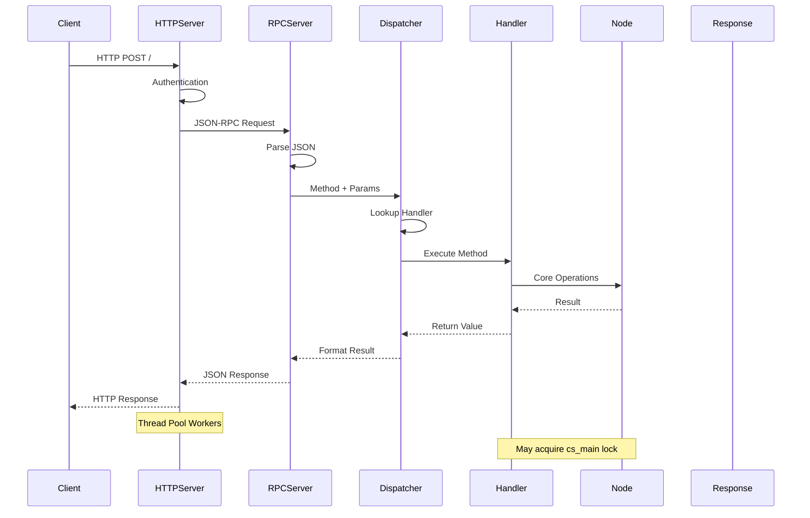

---

## 8. Wallet Transaction Creation

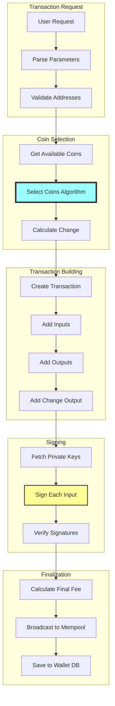

---

## 9. Mining and Block Creation

```mermaid
flowchart LR
    subgraph "Block Template"
        GETTEMPLATE[GetBlockTemplate]
        HEIGHT[Next Height]
        PREVBLOCK[Previous Block]
    end
    
    subgraph "Transaction Selection"
        MEMPOOL_SNAPSHOT[Mempool Snapshot]
        SORT_BY_FEE[Sort by Fee Rate]
        PACKAGE_EVAL[Package Evaluation]
        ADD_TXS[Add Transactions]
    end
    
    subgraph "Block Assembly"
        COINBASE[Create Coinbase]
        MERKLE_ROOT[Calculate Merkle Root]
        HEADER[Build Block Header]
        VALIDATE_WEIGHT[Check Weight/Size]
    end
    
    subgraph "Finalization"
        NONCE[Nonce/ExtraNonce]
        WITNESS[Witness Commitment]
        TEMPLATE[Complete Template]
    end
    
    GETTEMPLATE --> HEIGHT
    HEIGHT --> PREVBLOCK
    
    PREVBLOCK --> MEMPOOL_SNAPSHOT
    MEMPOOL_SNAPSHOT --> SORT_BY_FEE
    SORT_BY_FEE --> PACKAGE_EVAL
    PACKAGE_EVAL --> ADD_TXS
    
    ADD_TXS --> COINBASE
    COINBASE --> MERKLE_ROOT
    MERKLE_ROOT --> HEADER
    HEADER --> VALIDATE_WEIGHT
    
    VALIDATE_WEIGHT --> NONCE
    NONCE --> WITNESS
    WITNESS --> TEMPLATE
    
    style PACKAGE_EVAL fill:#9ff,stroke:#333,stroke-width:4px
    style MERKLE_ROOT fill:#ff9,stroke:#333,stroke-width:2px
```

---

## 10. Thread Model and Concurrency

```mermaid
graph TB
    subgraph "Main Thread"
        INIT[Initialization]
        SHUTDOWN[Shutdown Handler]
    end
    
    subgraph "Network Threads"
        MSGHAND[Message Handler Thread]
        SOCKET[Socket Thread]
        DNSADD[DNS Address Thread]
        UPNP_THR[UPnP Thread]
    end
    
    subgraph "Validation Threads"
        MAIN_VAL[Main Validation]
        SCRIPT1[Script Check Worker 1]
        SCRIPT2[Script Check Worker 2]
        SCRIPTN[Script Check Worker N]
    end
    
    subgraph "RPC Threads"
        HTTP1[HTTP Worker 1]
        HTTP2[HTTP Worker 2]
        HTTPN[HTTP Worker N]
    end
    
    subgraph "Background Tasks"
        SCHEDULER[CScheduler Thread]
        INDEXER[Index Build Thread]
        WALLET_FLUSH[Wallet Flush Thread]
    end
    
    subgraph "Shared Resources"
        CS_MAIN{{cs_main mutex}}
        CS_MEMPOOL{{mempool.cs mutex}}
        CS_WALLET{{wallet.cs mutex}}
    end
    
    MAIN_VAL -.-> CS_MAIN
    MSGHAND -.-> CS_MAIN
    HTTP1 -.-> CS_MAIN
    
    MSGHAND -.-> CS_MEMPOOL
    MAIN_VAL -.-> CS_MEMPOOL
    
    WALLET_FLUSH -.-> CS_WALLET
    HTTP1 -.-> CS_WALLET
    
    style CS_MAIN fill:#f99,stroke:#333,stroke-width:4px
    style MAIN_VAL fill:#ff9,stroke:#333,stroke-width:2px
```

---

## 11. Data Flow Integration

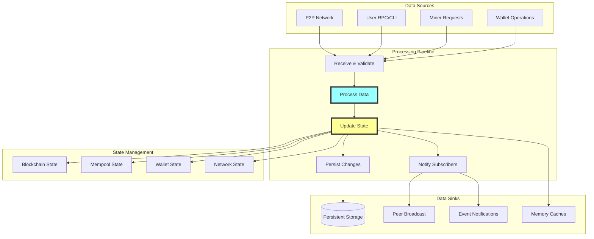

---

## 12. Error Handling and Recovery

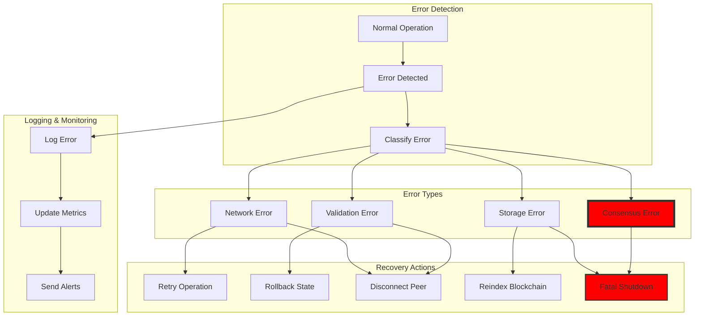

---

## Component Interaction Matrix

| Component | Validation | Network | Mempool | Storage | Wallet | RPC | Mining |
|-----------|------------|---------|---------|---------|--------|-----|--------|
| **Validation** | - | Receives blocks | Updates after block | Reads/Writes | Notifies | Status queries | Validates templates |
| **Network** | Sends blocks | - | Relays txs | - | - | Peer info | - |
| **Mempool** | Removed txs | Receives txs | - | - | Broadcasts | TX queries | Provides txs |
| **Storage** | Chain state | - | - | - | Wallet DB | - | - |
| **Wallet** | Balance updates | - | Sends txs | Reads/Writes | - | Wallet RPCs | - |
| **RPC** | Chain queries | Peer control | TX queries | - | Wallet ops | - | Mining RPCs |
| **Mining** | New blocks | - | Selects txs | - | - | Templates | - |

---

## Key Design Patterns

### 1. Observer Pattern
- **ValidationInterface**: Notifies subscribers of blockchain events
- **CMainSignals**: Manages signal delivery to multiple observers
- Used for wallet updates, index building, and P2P relay

### 2. Command Pattern
- **RPC Commands**: Each RPC method is a command object
- Enables dynamic registration and dispatch
- Supports permission-based access control

### 3. Strategy Pattern
- **Coin Selection**: Multiple algorithms for transaction input selection
- **Fee Estimation**: Different models for predicting confirmation times
- **Script Validation**: Configurable validation flags

### 4. Chain of Responsibility
- **Message Processing**: Network messages pass through handler chain
- **Error Handling**: Errors bubble up through component layers
- **Validation Pipeline**: Sequential validation steps

### 5. Template Method
- **Block Template Creation**: Customizable mining algorithm
- **Transaction Validation**: Standard flow with override points
- **Index Building**: Base class with derived implementations

---

## Performance Critical Paths

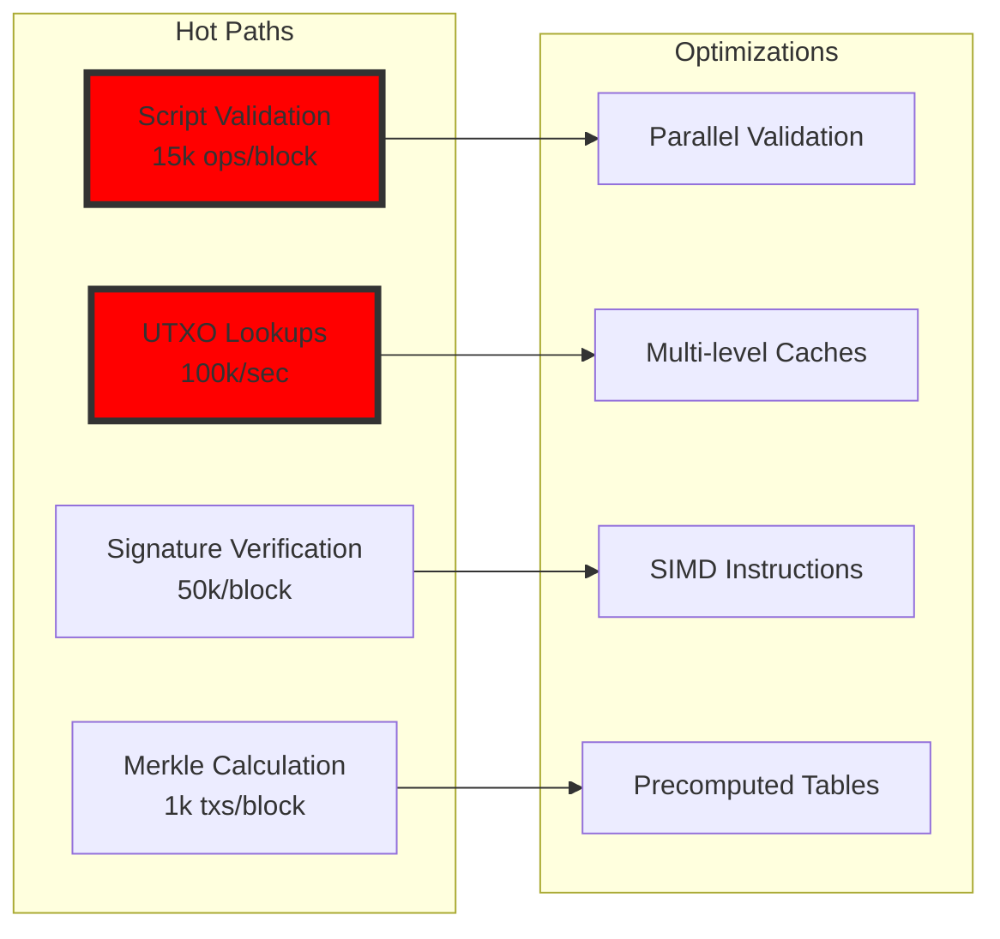

---

## Security Boundaries

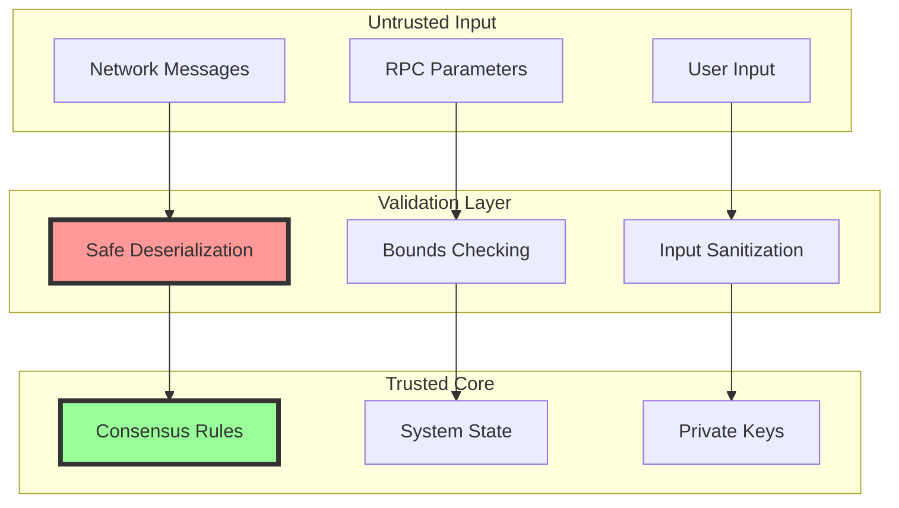

This comprehensive set of diagrams provides a complete visual understanding of Bitcoin Core's architecture, showing:

1. **System structure** - How components are organized
2. **Data flows** - How information moves through the system
3. **Processing pipelines** - Step-by-step operations
4. **Concurrency model** - Thread interactions and synchronization
5. **Error handling** - Recovery and resilience mechanisms
6. **Performance paths** - Critical optimization points
7. **Security boundaries** - Trust zones and validation layers

Each diagram can be rendered using any Mermaid-compatible viewer or documentation system.