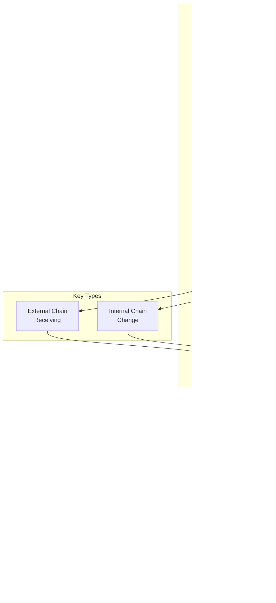

# Bitcoin Core Detailed Flow Diagrams

This document contains specialized diagrams showing detailed flows, state machines, and architectural patterns in Bitcoin Core.

## Table of Contents
1. [Block Validation State Machine](#1-block-validation-state-machine)
2. [Transaction Lifecycle](#2-transaction-lifecycle)
3. [Chain Reorganization Process](#3-chain-reorganization-process)
4. [UTXO Cache Hierarchy](#4-utxo-cache-hierarchy)
5. [Network Message Flow](#5-network-message-flow)
6. [Fee Estimation Algorithm](#6-fee-estimation-algorithm)
7. [Script Validation Pipeline](#7-script-validation-pipeline)
8. [Wallet Key Derivation](#8-wallet-key-derivation)
9. [Database Transaction Flow](#9-database-transaction-flow)
10. [Initial Block Download (IBD)](#10-initial-block-download-ibd)
11. [Memory Pool Package Handling](#11-memory-pool-package-handling)
12. [Consensus Fork Resolution](#12-consensus-fork-resolution)

---

## 1. Block Validation State Machine

---

## 2. Transaction Lifecycle

---

## 3. Chain Reorganization Process

---

## 4. UTXO Cache Hierarchy

---

## 5. Network Message Flow

---

## 6. Fee Estimation Algorithm

---

## 7. Script Validation Pipeline

---

## 8. Wallet Key Derivation

---

## 9. Database Transaction Flow

---

## 10. Initial Block Download (IBD)

---

## 11. Memory Pool Package Handling

---

## 12. Consensus Fork Resolution

---

## Integration Points and Data Flow Summary

---

## Performance Bottlenecks and Optimization Points

These detailed diagrams provide deep insights into:

1. **State machines** - How components transition between states
2. **Sequence flows** - Step-by-step message and data flows
3. **Decision trees** - How the system makes choices
4. **Data structures** - Hierarchical organization of data
5. **Algorithms** - Visual representation of key algorithms
6. **Integration patterns** - How components work together
7. **Performance analysis** - Where bottlenecks occur

Each diagram focuses on a specific aspect of Bitcoin Core's architecture, providing the detail needed to understand both the individual components and how they integrate into the complete system.