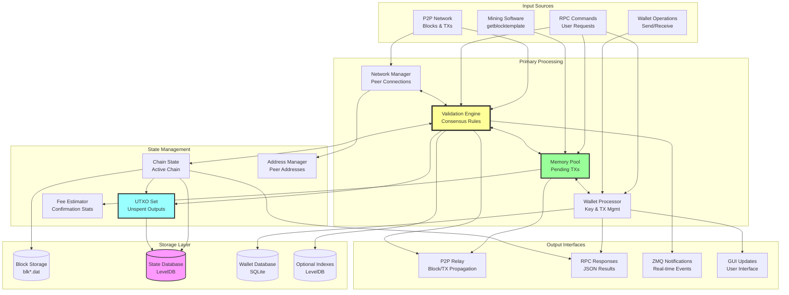
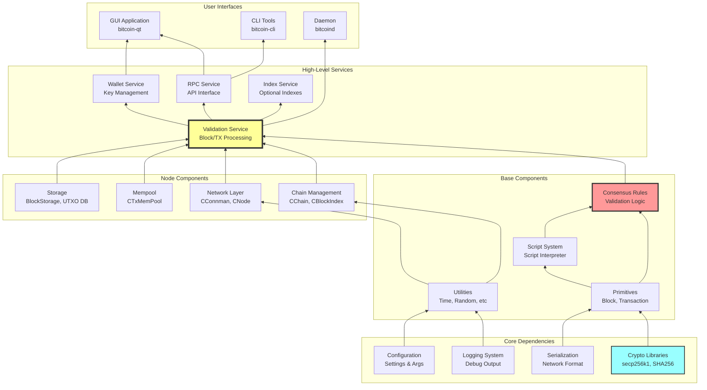
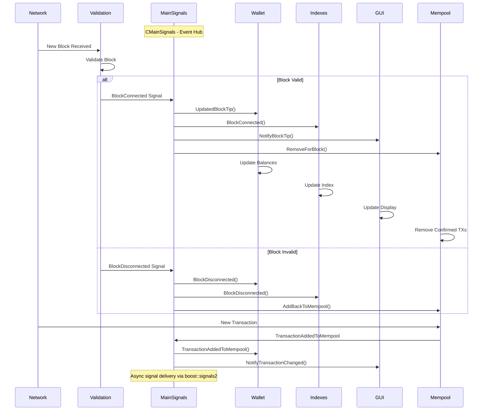
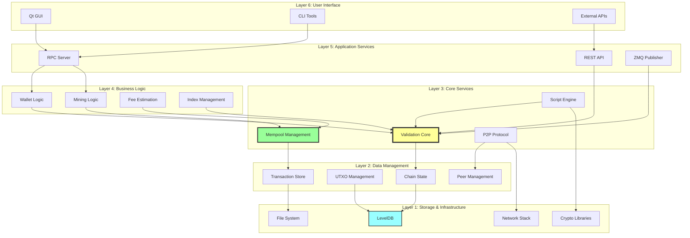
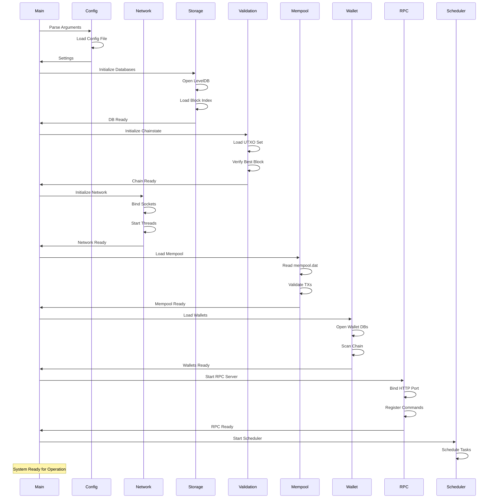
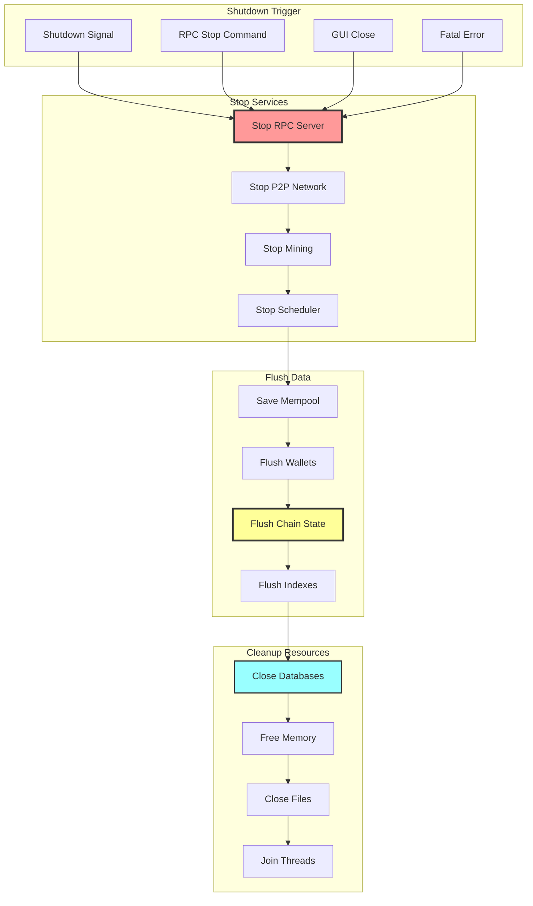
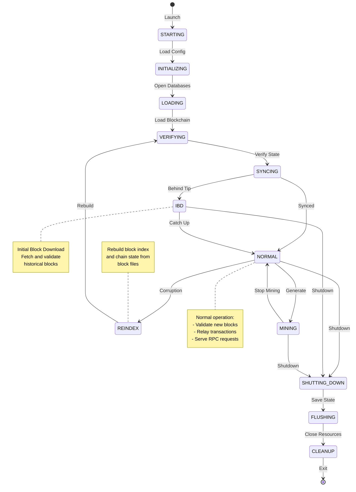
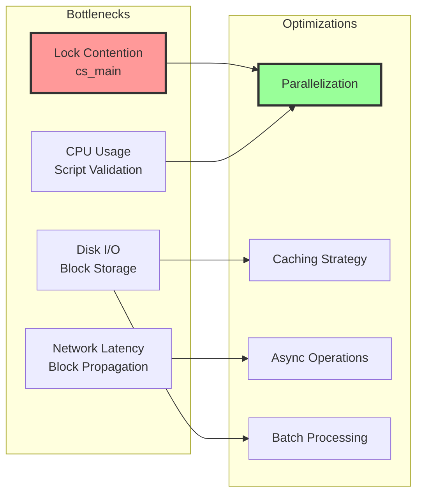

# Bitcoin Core System Integration Diagrams

This document provides comprehensive system-level integration diagrams showing how all components work together as a cohesive system.

## Table of Contents
1. [Complete System Data Flow](#1-complete-system-data-flow)
2. [Component Dependency Graph](#2-component-dependency-graph)
3. [Event Propagation System](#3-event-propagation-system)
4. [Layered Architecture View](#4-layered-architecture-view)
5. [Cross-Component Transaction Flow](#5-cross-component-transaction-flow)
6. [System Initialization Sequence](#6-system-initialization-sequence)
7. [Shutdown and Cleanup Flow](#7-shutdown-and-cleanup-flow)
8. [Full Node Operation Lifecycle](#8-full-node-operation-lifecycle)

---

## 1. Complete System Data Flow

---

## 2. Component Dependency Graph

---

## 3. Event Propagation System

---

## 4. Layered Architecture View

---

## 5. Cross-Component Transaction Flow

```mermaid
graph LR
    subgraph "Transaction Creation"
        USER[User Request]
        WALLET_CREATE[Wallet<br/>Create TX]
        SIGN[Sign TX]
    end
    
    subgraph "Local Validation"
        MEMPOOL_ACCEPT[Mempool<br/>Accept]
        POLICY_CHECK[Policy<br/>Checks]
        SCRIPT_CHECK[Script<br/>Validation]
    end
    
    subgraph "Network Propagation"
        INV_SEND[Send INV]
        PEER_REQUEST[Peer<br/>GETDATA]
        TX_SEND[Send TX]
    end
    
    subgraph "Remote Processing"
        PEER_VALIDATE[Peer<br/>Validates]
        PEER_MEMPOOL[Peer<br/>Mempool]
        PEER_RELAY[Peer<br/>Relays]
    end
    
    subgraph "Mining Inclusion"
        MINER_SELECT[Miner<br/>Selects TX]
        BLOCK_CREATE[Create<br/>Block]
        BLOCK_MINE[Mine<br/>Block]
    end
    
    subgraph "Confirmation"
        BLOCK_PROP[Block<br/>Propagated]
        BLOCK_VALID[Block<br/>Validated]
        TX_CONFIRM[TX<br/>Confirmed]
    end
    
    USER --> WALLET_CREATE
    WALLET_CREATE --> SIGN
    SIGN --> MEMPOOL_ACCEPT
    
    MEMPOOL_ACCEPT --> POLICY_CHECK
    POLICY_CHECK --> SCRIPT_CHECK
    SCRIPT_CHECK --> INV_SEND
    
    INV_SEND --> PEER_REQUEST
    PEER_REQUEST --> TX_SEND
    TX_SEND --> PEER_VALIDATE
    
    PEER_VALIDATE --> PEER_MEMPOOL
    PEER_MEMPOOL --> PEER_RELAY
    PEER_MEMPOOL --> MINER_SELECT
    
    MINER_SELECT --> BLOCK_CREATE
    BLOCK_CREATE --> BLOCK_MINE
    BLOCK_MINE --> BLOCK_PROP
    
    BLOCK_PROP --> BLOCK_VALID
    BLOCK_VALID --> TX_CONFIRM
    
    style MEMPOOL_ACCEPT fill:#9f9,stroke:#333,stroke-width:3px
    style BLOCK_VALID fill:#ff9,stroke:#333,stroke-width:3px
    style TX_CONFIRM fill:#9ff,stroke:#333,stroke-width:3px
```

---

## 6. System Initialization Sequence

---

## 7. Shutdown and Cleanup Flow

---

## 8. Full Node Operation Lifecycle

---

## Integration Summary

### Key Integration Patterns

1. **Event-Driven Architecture**
   - CMainSignals for loose coupling between components
   - Asynchronous notification of state changes
   - Observer pattern for extensibility

2. **Layered Dependencies**
   - Clear separation between layers
   - Dependencies flow downward only
   - Interfaces abstract implementation details

3. **Shared State Management**
   - Critical sections protected by mutexes
   - Lock ordering to prevent deadlocks
   - Atomic operations for simple state

4. **Resource Lifecycle**
   - RAII for automatic cleanup
   - Explicit initialization order
   - Graceful shutdown sequence

5. **Cross-Component Communication**
   - Direct function calls within layers
   - Event signals across layers
   - Message passing for network operations

### Performance Considerations

### Critical Data Flows

1. **Block Processing**: Network → Validation → Storage → Notifications
2. **Transaction Flow**: Wallet → Mempool → Network → Mining → Confirmation
3. **State Updates**: Validation → UTXO Set → Database → Cache
4. **Query Path**: RPC → Validation/Wallet → Response

These integration diagrams demonstrate how Bitcoin Core's components work together as a cohesive system, with clear boundaries, well-defined interfaces, and robust error handling throughout the architecture.